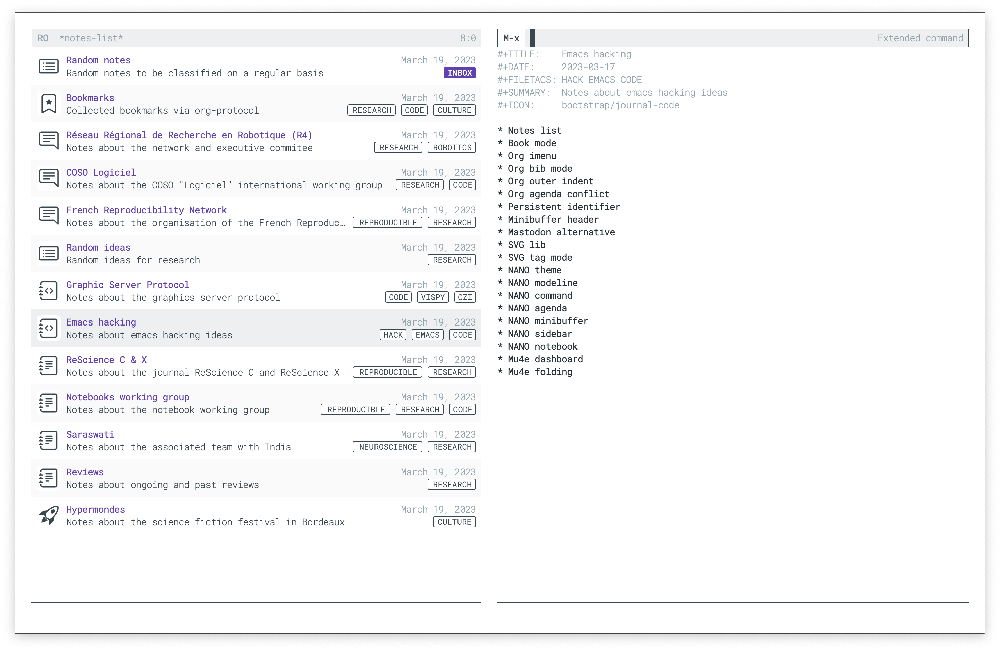

# Notes list

Notes list collects notes in user-defined directories and populate a buffer with a summary of each note. To do so, notes are parsed such as to extract title, icon, date, summary and tags. A typical org note header is thus

```
#+TITLE:    Emacs hacking
#+DATE:     2023-03-17
#+FILETAGS: HACK EMACS CODE
#+SUMMARY:  Notes about emacs hacking ideas
#+ICON:     bootstrap/journal-code
```

Icons are build using the
[svg-lib](https://github.com/rougier/svg-lib) library and syntax is
`collection/name` where collection is one one `simple`, `bootstrap`,
`material` and `octicons`. For available icons, please refere to the
svg-lib documentation.


